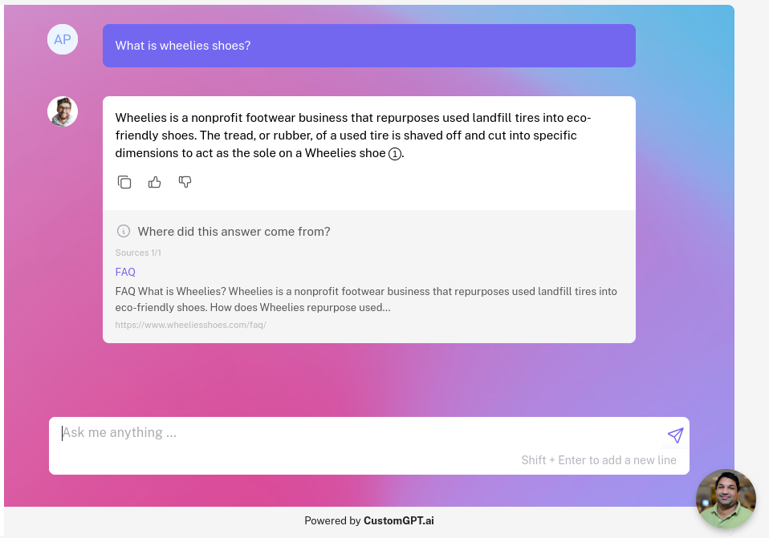

# WordPress Private Content to CustomGPT AI Agent Builder

[](https://opensource.org/licenses/MIT)
[](https://www.python.org/downloads/)
[](https://wordpress-to-customgpt.streamlit.app/)

A powerful and user-friendly tool to securely sync your private WordPress content to CustomGPT, enabling you to build AI agents with your private/paywalled data.

## How To Use It?
We provide an easy to use [no-code hosted Streamlit app](https://wordpress-to-customgpt.streamlit.app/). You can also self host the streamlit app if you'd like.

## Table of Contents
- [Features](#features)
- [Prerequisites](#prerequisites)
- [Installation](#installation)
- [Usage](#usage)
- [Configuration](#configuration)
- [Contributing](#contributing)
- [License](#license)
- [Support](#support)

## Demo Video

[](https://www.loom.com/share/077b0015d55648c09e67a1c5d78949a1?sid=59fd73cb-2e6a-41bb-9b33-85a2e3ade336)

[Click here to watch the full demo video](https://www.loom.com/share/077b0015d55648c09e67a1c5d78949a1?sid=59fd73cb-2e6a-41bb-9b33-85a2e3ade336)

## Features

- 🔒 Secure sync of private WordPress content to CustomGPT
- 🔄 Support for both posts and pages
- 📊 Build AI agents from private, paywalled and logged-in data. 
- 🚀 Detailed citations and sources (for driving subscriptions and accessing paywalled data)
- ✅ Indexing status check and confirmation



## Prerequisites

Before you begin, ensure you have met the following requirements:

- Python 3.7 or higher
- A WordPress website with a read-only user with access to private/paywalled content. 
- A CustomGPT account with API access

## Installation

1. Clone the repository:
   ```
   git clone https://github.com/adorosario/wordpress-to-customgpt.git
   cd wordpress-to-customgpt
   ```

2. Install the required dependencies:
   ```
   pip install -r requirements.txt
   ```

## Usage

1. Run the Streamlit app:
   ```
   streamlit run app.py
   ```

2. Open your web browser and navigate to the provided local URL (usually `http://localhost:8501`).

3. Fill in the required fields:
   - WordPress Website URL
   - WordPress Username
   - WordPress Application Password
   - CustomGPT API Key

4. Click "Fetch and Transfer Data" to start the process.

5. Monitor the progress and wait for the confirmation of successful transfer and indexing.

## Configuration

### WordPress Setup

1. Log in to your WordPress admin panel.
2. Navigate to Users > Your Profile.
3. Scroll down to the Application Passwords section.
4. Enter a name for the application password (e.g., "CustomGPT Transfer") and click "Add New Application Password".  [Need Help?](https://make.wordpress.org/core/2020/11/05/application-passwords-integration-guide/)
5. Copy the generated password - you'll need this for the "WordPress Application Password" field in the app.

### CustomGPT Setup

1. Log in to your [CustomGPT account](https://app.customgpt.ai/).
2. Navigate to your profile settings.
3. Find your API key in the [API section](https://app.customgpt.ai/profile#api).
4. Use this API key in the "CustomGPT API Key" field in the app.

## Contributing

Contributions to the WordPress to CustomGPT Data Transfer project are welcome! Here's how you can contribute:

1. Fork the repository.
2. Create a new branch: `git checkout -b feature-branch-name`.
3. Make your changes and commit them: `git commit -m 'Add some feature'`.
4. Push to the branch: `git push origin feature-branch-name`.
5. Create a pull request.

## License

This project is licensed under the [MIT License](https://opensource.org/licenses/MIT).

## Support

If you encounter any problems or have any questions, please open an issue in the GitHub repository or contact the maintainers directly.

---

Made with ❤️ by [adorosario](https://github.com/adorosario)